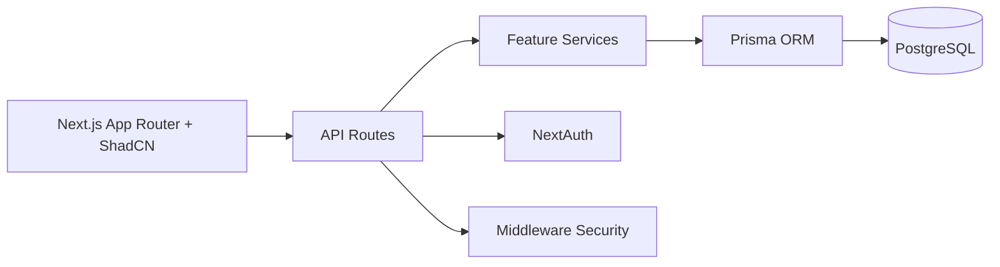
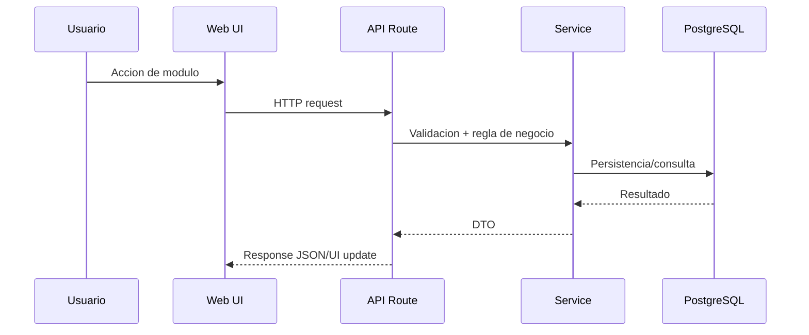

# 03. Arquitectura Completa

## Estilo arquitectonico
- Clean Architecture.
- Estructura por feature.
- Patron Repository + Service Layer.
- API Routes para capa de entrada.

## Capas
- Presentation: App Router, paginas, componentes UI.
- Application: servicios de negocio por modulo.
- Infrastructure: Prisma, NextAuth, middleware de seguridad.
- Cross-cutting: validacion (Zod), auditoria, rate-limiting, headers.

## Diagrama de componentes

## Diagrama de flujo principal

  ## Roadmap tecnico
  1. Fase 1: Foundation
    - Setup base, Prisma, auth, seguridad y layout modular.
  2. Fase 2: Productividad academica
    - Completar formularios CRUD para Knowledge, Learning, Labs y Writeups.
  3. Fase 3: Inteligencia operativa
    - Analitica avanzada, reportes PDF/MDX y simulacion SIEM enriquecida.
  4. Fase 4: Portafolio profesional
    - Exportacion de logros, CV tecnico dinamico y panel publico controlado.
  5. Fase 5: Hardening enterprise
    - Auditoria avanzada, observabilidad, backup/restore y controles RBAC granulares.
