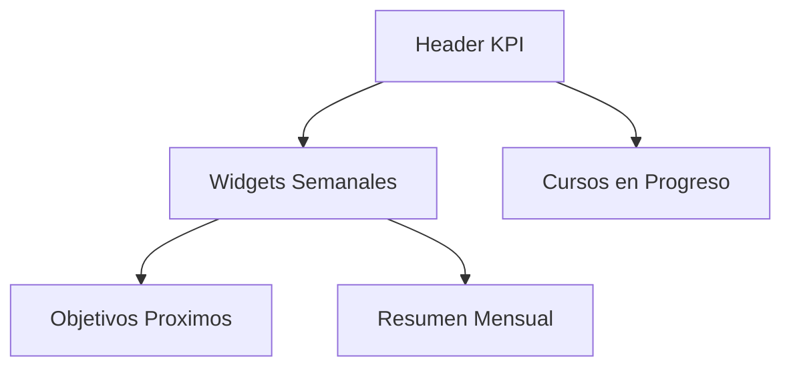
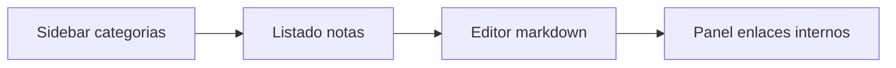
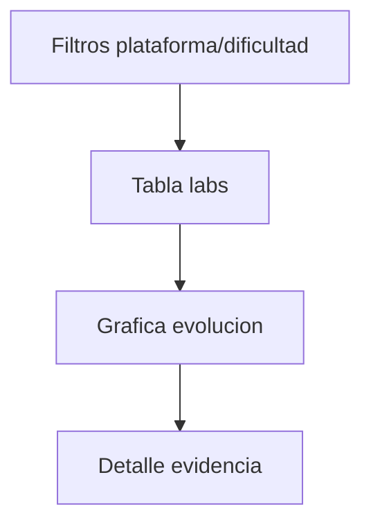

# 05. Wireframes

## Wireframe Dashboard

```mermaid
flowchart TB
  A[Header KPI] --> B[Widgets Semanales]
  A --> C[Cursos en Progreso]
  B --> D[Objetivos Proximos]
  B --> E[Resumen Mensual]
```

## Wireframe Knowledge Hub

```mermaid
flowchart LR
  A[Sidebar categorias] --> B[Listado notas]
  B --> C[Editor markdown]
  C --> D[Panel enlaces internos]
```

## Wireframe Lab Manager

```mermaid
flowchart TB
  A[Filtros plataforma/dificultad] --> B[Tabla labs]
  B --> C[Grafica evolucion]
  C --> D[Detalle evidencia]
```
