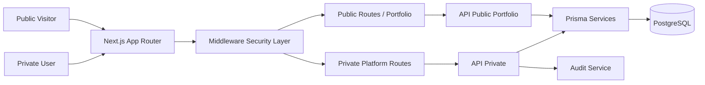

# 21. Arquitectura de Producción

## Vista general

## Capas

1. Presentación
- Páginas App Router
- Componentes cliente en módulos interactivos

2. Aplicación
- Route Handlers (`src/app/api/**`)
- Middleware global de seguridad

3. Dominio
- Servicios por módulo en `src/server/modules/**`

4. Datos
- Prisma ORM
- PostgreSQL

## Seguridad por diseño

- Authentication gate en middleware
- RBAC en endpoints de auditoría
- Input validation con Zod
- Sanitización de texto
- Rate limiting por IP
- Security headers defensivos

## Estrategia de despliegue

- Build Next standalone
- Imagen Docker multi-stage
- Orquestación con docker compose
- Release pipeline en GitHub Actions + GHCR
